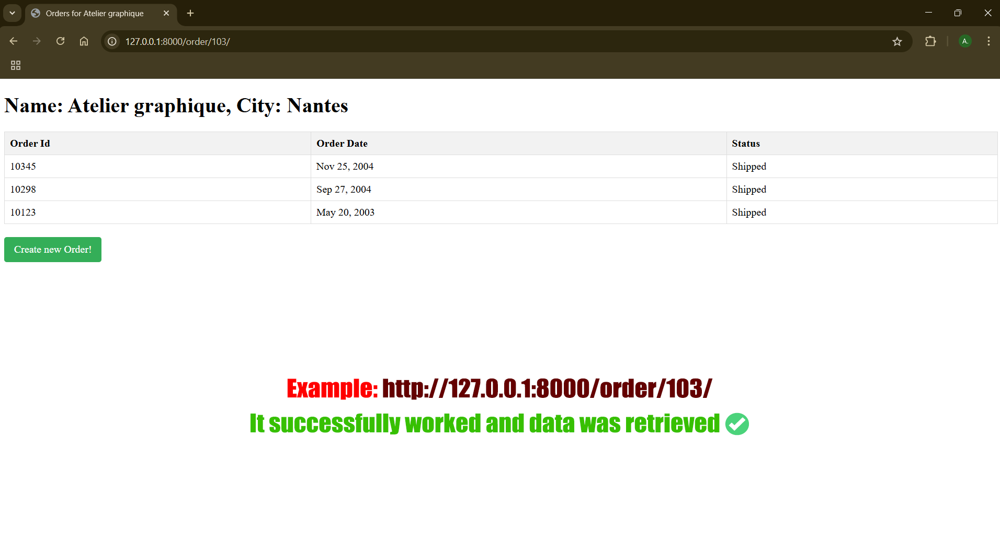
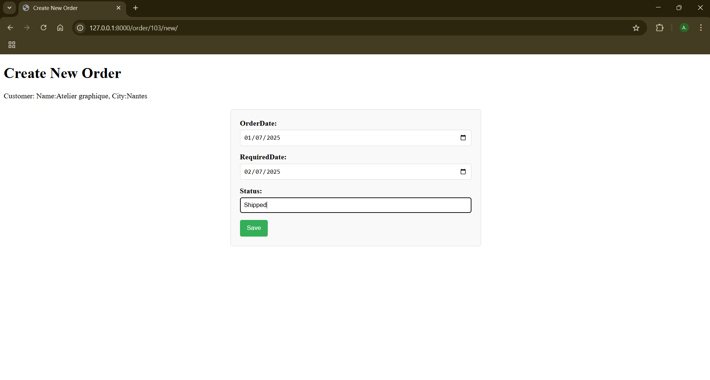

# Django Classic Models Order Management System
Django lab project for managing Classic Models orders. Implements persistence, relational models, and form-based order creation.


A web application built with Django to manage customer orders, products, and order details, based on the "Classic Models" database schema. Developed as part of a lab assignment for **Web Application Persistence** at the University of Applied Sciences Ulm.

---

## ✨ Key Features

- **Relational Data Modeling**:  
  Implemented Django models for `Customer`, `Order`, `OrderDetail`, and `Product` with proper relationships (1:N, M:N).
- **Order Management**:  
  - View all orders per customer with dynamic templates.  
  - Create new orders via Django forms.  
- **Data Migration**:  
  Imported legacy SQL data from "Classic Models Simple" database using raw SQL queries.  
- **UI Templates**:  
  Bootstrap-friendly HTML templates for displaying orders and forms.  

---

## 🛠️ Tech Stack

- **Backend**: Django (Python)  
- **Database**: SQLite (default) / MySQL-compatible schema  
- **Frontend**: Django Templates (HTML/CSS)  
- **Persistence**: Django ORM, raw SQL migration  

---

## 🚀 Quick Start

1. **Clone the repository**:
   ```bash
   git clone https://github.com/Abol3ninn/django-classicmodels-orders.git
   cd django-classicmodels-orders

2. **Set up a virtual environment**:
    ```bash
    python -m venv venv
    source venv/bin/activate  # Linux/Mac
    venv\Scripts\activate    # Windows

3. **Install dependencies**:
    ```bash
    pip install -r requirements.txt

4. **Run migrations**:
    ````bash
    python manage.py migrate

5. **Load sample data (optional)**:
    ```bash
    python manage.py shell < load_sample_data.py  # Custom script to seed DB

6. **Start the server**:
    ```bash
    python manage.py runserver
    Open http://127.0.0.1:8000/order/ in your browser.


## 📂 Project Structure

django-classicmodels-orders/
├── order/               # Django app
│   ├── models.py        # Customer, Order, Product, OrderDetail models
│   ├── views.py         # Order display and creation logic
│   ├── templates/       # HTML templates
│   └── ...
├── classic/             # Django project config
├── README.md
└── requirements.txt


## 🖼️ Screenshots

| Orders List View          | Create Order Form          |
|---------------------------|----------------------------|
|  |  |


## 🙏 Acknowledgments
- Lab assignment by Prof. Dr. Volker Herbort, University of Applied Sciences Ulm.
- Database schema adapted from "Classic Models Simple".
